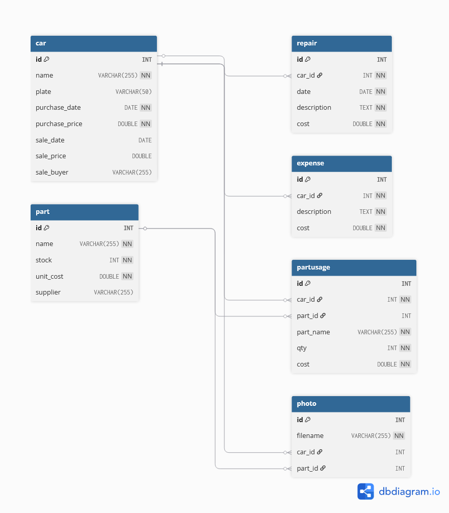

# garage-ledger

A local app to track cars bought, repaired and sold: costs, profit per car, overall business summary, parts inventory, and finances — backed by a SQLite database with photo support for cars and parts.

## Structure

- `backend/` — FastAPI server + SQLite database (`garage.db`, created automatically on first run) + uploaded photos (`backend/uploads/`)
- `frontend/` — the web interface, served by the backend at `/app`

## Requirements

Python 3.9 or above.


## Setup (first time only)

Open terminal in this folder and run:

```bash
cd backend
pip install -r requirements.txt
```

## Running it

From root run: 

```bash
python -m uvicorn backend.main:app --reload
```

Then open **http://127.0.0.1:8000/app/** in a browser.


